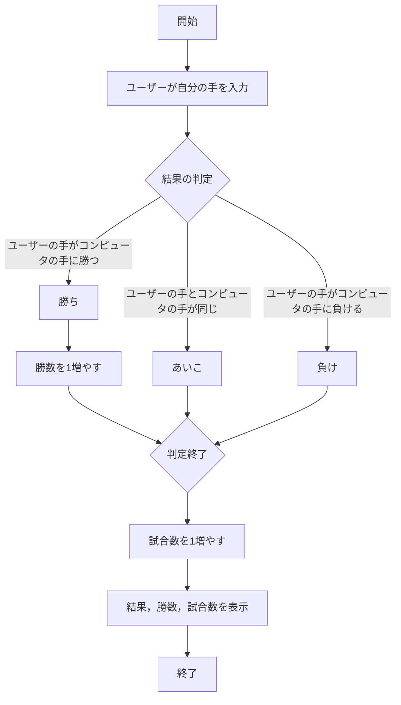
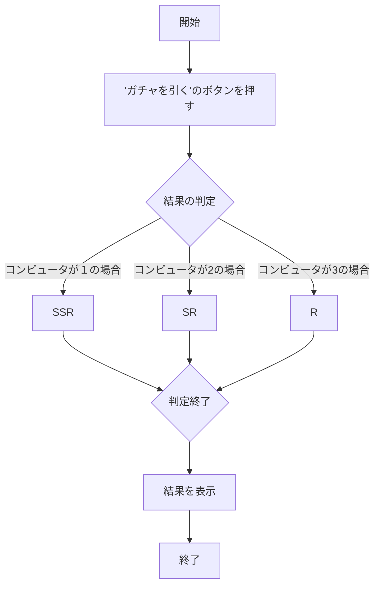
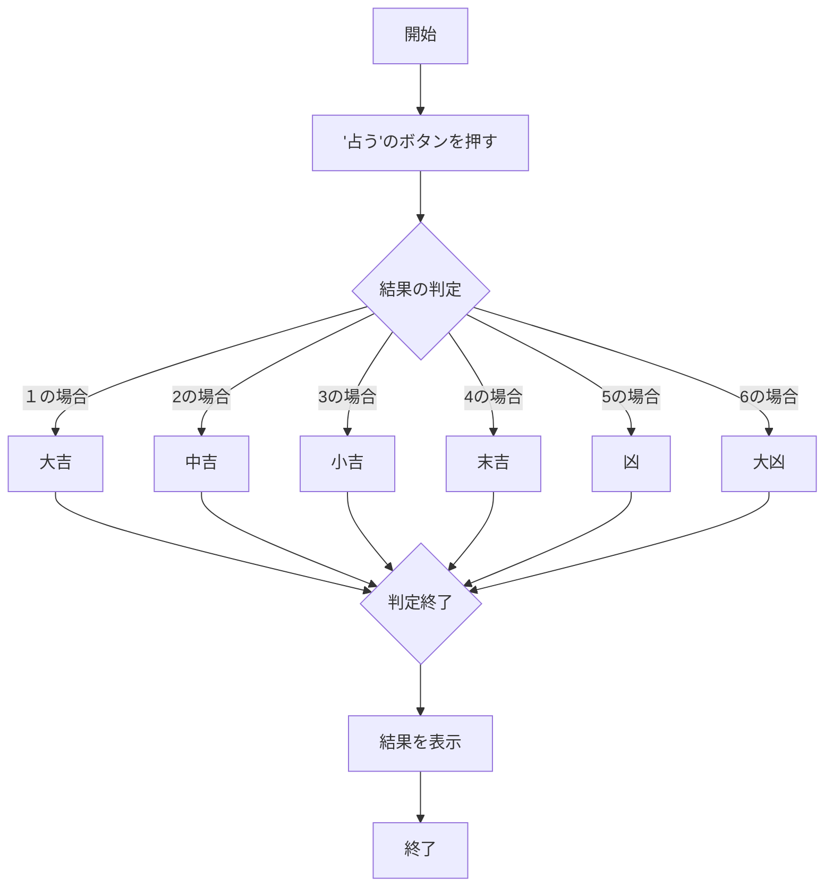
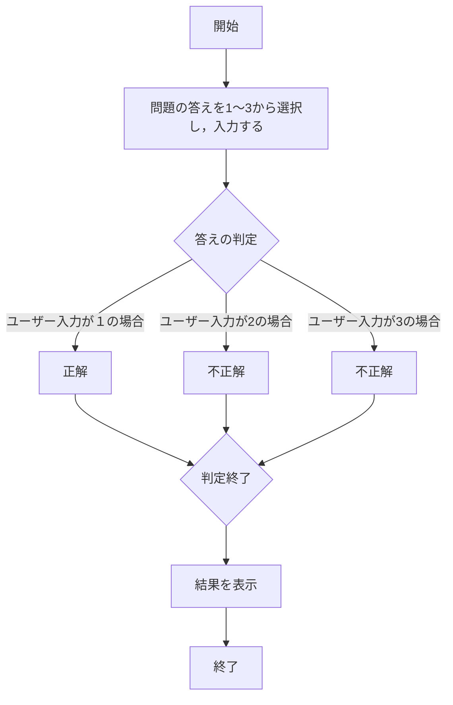

# webpro_06
## app5.jsのプログラムについて
### ファイル一覧
ファイル名 | 説明
-|-
app5.js |じゃんけん，ガチャ，おみくじ，クイズのプログラム本体
public/janken.html | じゃんけんの開始画面
public/gacha.html | ガチャの開始画面
public/luck.html | おみくじの開始画面
public/quiz.html | クイズの開始画面
view/janken.ejs | じゃんけんのテンプレート，結果画面
view/gacha-result.ejs | ガチャのテンプレート，結果画面
view/luck.ejs | おみくじのテンプレート，結果画面
view/quiz-result.ejs | クイズのテンプレート，結果画面

## じゃんけんの仕様手順
1. ターミナルを開き```node app5.js```でプログラムを起動する．
1. Webブラウザでlocalhost:8080/public/janken.htmlにアクセスする．
1. 自分の手を入力する.
1. 自分の手とコンピュータの手を比較し，結果，勝数，試合数を表示する．
1. ユーザーは結果を確認し，再度じゃんけんを行うことができる．
## じゃんけんの仕様
　このじゃんけんシステムではユーザーがじゃんけんの手を決めてコンピュータとの対戦結果を基に勝敗を表示する．ユーザーの手とコンピュータの手を比較し，結果に応じて勝ち数や総試合数を更新する．結果はテンプレートを使って画面に表示される．

　まず```app.get("/janken", (req, res) ```で/jankenというURLに対するリクエストを処理する．req.queryを使用してユーザーの手（hand），勝数（win），試合数（total）を受け取る．console.log関数でhand，win，totalの変数を定義する．

　次に```Math.floor(Math.random() * 3 + 1)```で1〜3までのランダムな整数を生成する．そのランダムな整数に応じて，コンピュータの選択を以下のように決定する．
- ```１の場合```：**グー**
- ```２の場合```：**チョキ**
- ```３の場合```：**パー**

ユーザの手とコンピュータの手を比較して結果を判定するために以下の仕様にする．
- ```あいこの場合```：ユーザーの手とコンピュータの手が一緒のとき**あいこ**を表示する.
- ```勝ちの場合```：ユーザーの手がコンピュータの手に勝ったとき**勝ち**を表示し，**勝数**（win）を１増やす．
- ```負けの場合```：ユーザーの手がコンピュータの手に負けたとき**負け**を表示する

以上の仕様を施す．また判定後，**試合数**（total）を1増やす．

　最後に```res.render('janken', display)```でjanken.ejsテンプレートにデータ（ユーザーの手，コンピュータの手，結果，勝数，試合数）を渡し，表示する．
## フローチャート



## ガチャの仕様手順
1. ターミナルを開き```node app5.js```でプログラムを起動する．
1. Webブラウザでlocalhost:8080/public/gacha.htmlにアクセスする．
1. 画面に表示されている**ガチャを引く**のボタンを押す．
1. SSR，SR，Rのいずれかの結果が表示される．
## ガチャの仕様
　このガチャシステムではユーザーが「ガチャを引く」のボタンを押し，その結果がランダムに決定され，表示される．getリクエストでガチャフォームを表示しpostリクエストで1から3の間のランダムな数字が生成され，ガチャの結果（SSR，SR，R）を決定する．結果はテンプレートを使って画面に表示される．

　まず```app.get("/gacha", (req, res) ```で/gachaというURLに対するリクエストを処理する．```res.render('gacha-form')```でユーザーにガチャを引くためのボタンなどが含まれたフォームを表示する．ユーザーがガチャフォームでリクエストを送信すると，/gacha への postリクエストが処理される．

　次に```Math.floor(Math.random() * 3 + 1);```で1〜3までのランダムな整数を生成する．そのランダムな整数に応じて，コンピュータの選択を以下のように決定する．
- ```１の場合```：**SSR**
- ```２の場合```：**SR**
- ```３の場合```：**R**

この結果は```ga```という変数に格納される．

　最後に```res.render('gacha-result', display)```でgacha-result というテンプレートにデータ（ガチャの結果）を渡し，表示する．

## フローチャート




## おみくじの仕様手順
1. ターミナルを開き```node app5.js```でプログラムを起動する．
1. Webブラウザでlocalhost:8080/public/luck.htmlにアクセスする．
1. 画面に表示されている**占う**のボタンを押す．
1. 大吉，中吉，小吉，末吉，凶，大凶のいずれかの結果が表示される．

## おみくじの仕様
　このおみくじシステムはユーザーが「占う」のボタンを押し，その結果がランダムに決定され，表示される．1から6の間のランダムな数字が生成され，それに対応する運勢（大吉,中吉,小吉,末吉,凶,大凶）が決定する．結果はテンプレートを使って画面に表示される．

　まず```app.get("/luck", (req, res) ```で/luckというURLに対するリクエストを処理する．

　次に```Math.floor(Math.random() * 6 + 1);```で1〜6までのランダムな整数を生成する．そのランダムな整数に応じて，コンピュータの選択を以下のように決定する．
- ```１の場合```：**大吉**
- ```２の場合```：**中吉**
- ```３の場合```：**小吉**
- ```４の場合```：**末吉**
- ```５の場合```：**凶**
- ```６の場合```：**大凶**

この運勢をluckという変数に格納する．

　最後に```res.render( 'luck', {luck:luck} )```でluckというテンプレートにデータ（運勢）を渡し，表示する.

## フローチャート




## クイズの仕様手順
1. ターミナルを開き```node app5.js```でプログラムを起動する．
1. Webブラウザでlocalhost:8080/public/quiz.htmlにアクセスする．
1. 画面に表示されている問題の答えを1〜3から選択し，入力する．
1. ユーザーに正解，不正解のどちらかを返す．

## クイズの仕様
　このクイズシステムはNode.jsのExpressフレームワークを使用してユーザーがクイズに回答した後，その結果が正解または不正解であるか判定して表示する．結果はテンプレートを使って画面に表示される．

　まず```app.get("/quiz", (req, res) ```で/quizというURLに対するリクエストを処理する．quiz.htmlで問題や選択肢などが表示され，ユーザーはその問題に対する答えをフォームで入力する．
ユーザーがクイズでリクエストを送信すると，フォームがpostリクエストとして送信され/quiz-resultルートにデータが届く．このときサーバー側では req.body.answer を受け取って処理する．

　次に```const userInput = Number(req.body.answer);```で```req.body.answer```の値を数値型に変換し，それを```userInput```という変数に格納する．```req.body.answer```はユーザーがフォームから送信したデータ（1〜3の数字）である．ユーザーの入力に対するコンピュータの判定（正解，不正解）を以下のように決定する．
- ```1の場合```：**正解**
- ```2の場合```：**不正解**
- ```3の場合```：**不正解**

　最後に```res.render('quiz-result', { result: result }) ```でquiz-resultというテンプレートにデータ（正解，不正解）を渡し，表示する．resultという変数に基づいて’正解’または’不正解’が画面に表示される．

## フローチャート





## githubでの管理方法
1. ターミナルを開く
1. 以下のコマンドを実行する．
- ＄　git add.
- ＄　git commit -am'修正，追加した内容をコメント'
- ＄　git push

以上の手順により，リポジトリにも反映されgithubでの管理を可能にする．
またVScodeで作成した新規ファイル，特定のファイルなどをgithubに反映させるときはaddの後ろにファイル名を指定して実行する．
