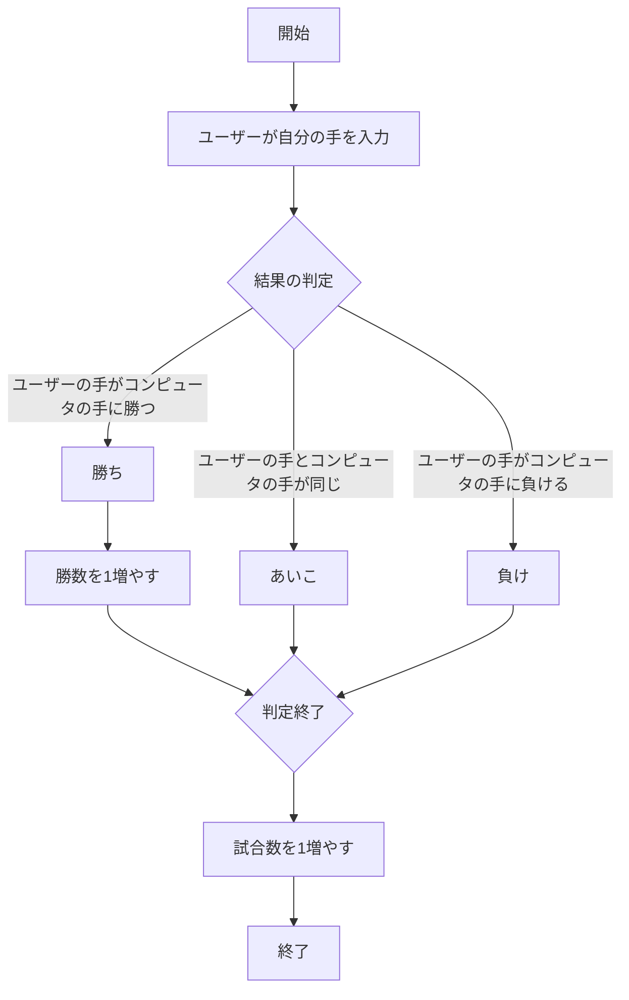

# webpro_06
## このプログラムについて
### ファイル一覧
ファイル名 | 説明
-|-
app5.js |じゃんけん，ガチャ，おみくじ，クイズのプログラム本体
public/janken.html | じゃんけんの開始画面
public/gacha.html | ガチャの開始画面
public/luck.html | おみくじの開始画面
public/quiz.html | クイズの開始画面
view/janken.ejs | じゃんけんのテンプレート，結果画面
view/gacha-result.ejs | ガチャのテンプレート，結果画面
view/luck.ejs | おみくじのテンプレート，結果画面
view/quiz-result.ejs | クイズのテンプレート，結果画面

## じゃんけんの仕様手順
1. ```node app5.js```でプログラムを起動する．app5.js を起動する．
1. Webブラウザでlocalhost:8080/public/janken.htmlにアクセスする．
1. 自分の手を入力する.
1. 自分の手とコンピュータの手を比較し，結果，勝数，試合数を表示する
1. ユーザーは結果を確認し，再度じゃんけんを行うことができる．
## じゃんけんの仕様
　まず```app.get("/janken", (req, res) ```で/jankenというURLに対するリクエストを処理する．req.queryを使用してユーザーの手（hand），勝数（win），試合数（total）を受け取る．console.log関数でhand，win，totalの変数を定義する．

　次に```Math.floor(Math.random() * 3 + 1)```で1〜3までのランダムな整数を生成する．そのランダムな整数に応じて，コンピュータの選択を以下のように決定する．
- ```１の場合```：**グー**
- ```２の場合```：**チョキ**
- ```３の場合```：**パー**
ユーザの手とコンピュータの手を比較して結果を判定するために以下の仕様にする．
- ```あいこの場合```：ユーザーの手とコンピュータの手が一緒のとき**あいこ**を表示する.
- ```勝ちの場合```：ユーザーの手がコンピュータの手に勝ったとき**勝ち**を表示し，**勝数**（win）を１増やす．
- ```負けの場合```：ユーザーの手がコンピュータの手に負けたとき**負け**を表示する
以上の仕様を施す．判定後，**試合数**（total）を1増やす．

　最後に```res.render('janken', display)```でjanken.ejsテンプレートにデータ（ユーザーの手，コンピュータの手，結果，勝数，試合数）を渡し，表示する．
## フローチャート



## githubでの管理方法
1. ターミナルを開く
1. 以下のコマンドを実行する．
＄　git add.
＄　git commit -am'修正，追加した内容をコメント'
＄　git push
以上の手順により，リポジトリにも反映されgithubでの管理を可能にする．
またVScodeで作成した新規ファイルをgithubに反映させるときはaddの後ろにファイル名を指定して実行する．
